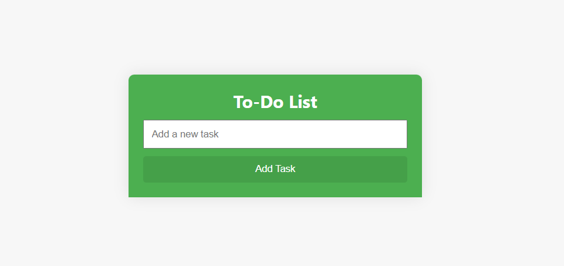
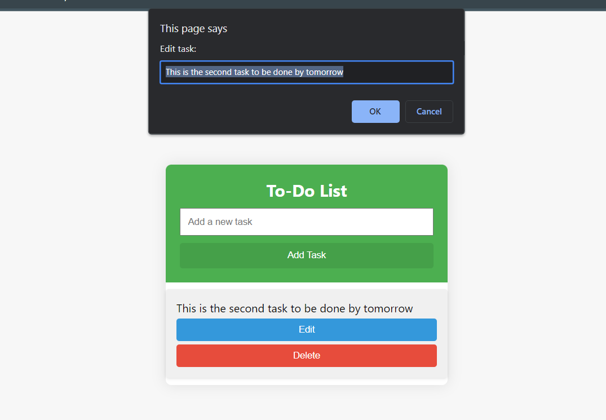
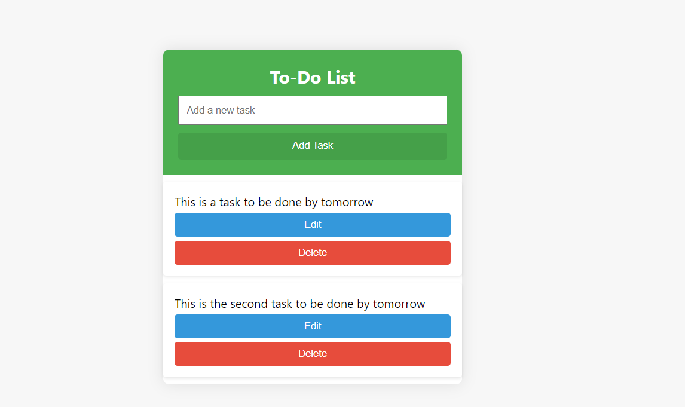
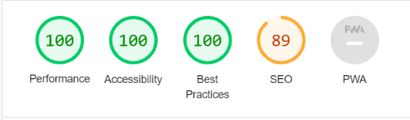
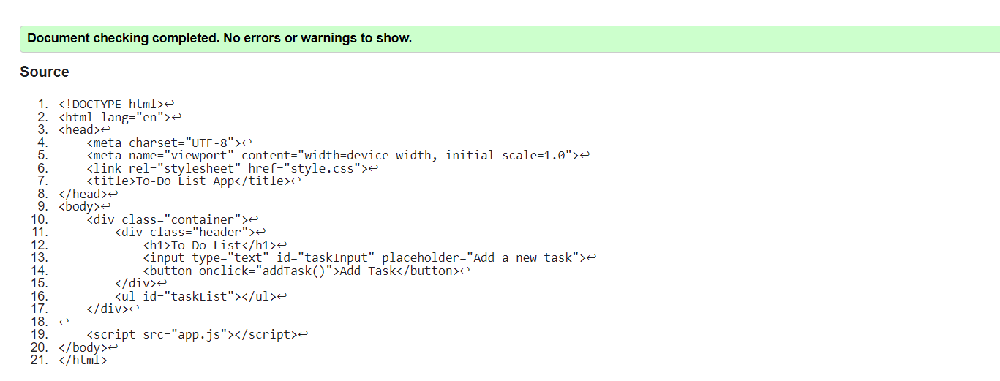
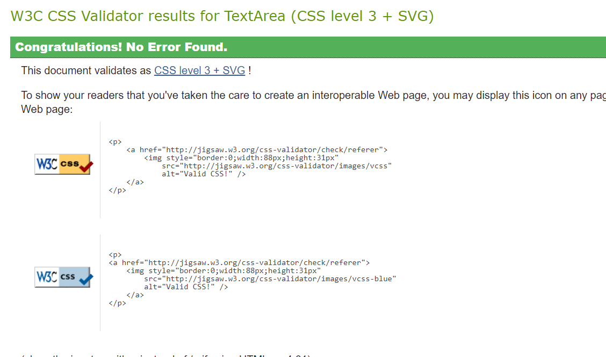

## Todo List
---

The To-Do List App is a simple and intuitive task management tool designed to help users organize their daily activities. With a clean and user-friendly interface, the app allows users to effortlessly add, edit, and delete tasks. Each task can be marked as completed with a single click, providing a visual indicator of progress.

<a href="https://ray-yar.github.io/to-do-list/" target="_blank">Visit the live project here</a>

## Features
---

- Add Tasks: 
    Users can quickly add new tasks by entering the task details in the input field and clicking the "Add Task" button.
    

- Edit Tasks: 
    The app offers the flexibility to edit existing tasks. Users can click the "Edit" button for a specific task, enter the new text, and save the changes.
    

- Delete Tasks: 
    Unwanted tasks can be easily removed from the list by clicking the "Delete" button associated with each task.

- Mark as Completed: 
    Tasks can be marked as completed by clicking on them. A visual indication, such as a change in background color, helps users identify completed tasks.

- Responsive Design: 
    The app is designed to provide a seamless experience on various screen sizes, ensuring accessibility from desktops, tablets, and mobile devices.
    

## Testing

---

**Chrome lighthouse**, I have tested Preformance, Accessibility, Best Practices, SEO and PWA in chrome lighthouse. And every thing was very smooth. Preformance was excellent.

## Validator Testing
- HTML
    - No errors were returned when passing through the official <a href="https://validator.w3.org/">W3C</a> validator

        
        
- CSS
    - No errors were found when passing through the official <a href="https://jigsaw.w3.org/css-validator/">Jigsaw</a> validator

        
        
- JavaScript
    - No errors were found when passing through the official <a href="https://jshint.com/">Jshint</a> validator

        

## Unfixed Bugs
- There was multi warnings related to javascript that was not able to be remove. So, I have added `/*jshint esversion: 6 */` code in the first line of JS codes to remove warnings.

## Deployment
This project was developed using <a href="https://gitpod.io/workspaces" target="_blank">GitPod</a>, committed to git and pushed to GitHub using git commands.

To deploy this page to GitHub Pages from its GitHub repository, the following steps were taken:

* Log into <a href="https://github.com/" target="_blank">GitHub</a>.
* From the list of repositories on the screen, select **Ray-yar/to-do-list**.
* From the menu items near the top of the page, select **Settings**.
* Scroll down to the GitHub Pages section.
* Under Source click the drop-down menu labelled **None** and select **Master Branch**. Then Save it.
* Wait for a few minutes of the website to be deployed.
* Scroll back down to the GitHub Pages section to access the link to the deployed website.

The live link can be found here - <a href="https://ray-yar.github.io/to-do-list/" target="_blank">https://ray-yar.github.io/to-do-list/</a>

## Acknowledgments

---

I would like to express my gratitude to everyone who contributed to the development of this To-Do List App. This project has been a journey of learning and growth, and I am thankful for the support and resources that made it possible.

I extend my appreciation to the open-source community for providing valuable insights and inspiration. Special thanks to the developers who have shared their knowledge through tutorials, forums, and code repositories, contributing to the improvement of my skills.

I am indebted to my instructors and mentors who guided me through the process, offering feedback and encouragement. Your expertise and encouragement have been instrumental in shaping this project.

Lastly, I want to thank my peers and friends for their encouragement and constructive feedback. Your input has been invaluable in refining the features and user experience of this app.

This project has been a collaborative effort, and I am grateful for the collective support that has made it possible.